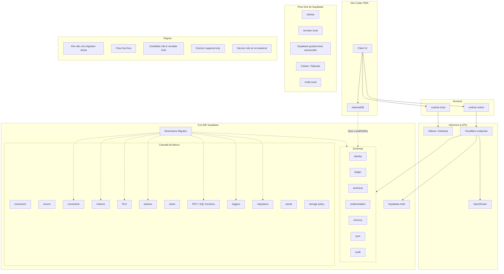

# Klio Supabase Architecture

Klio Coder é o app técnico privado da K∧LINE.

Klio não possui Supabase isolado.

Klio participa do Supabase K∧LINE compartilhado, dentro do escopo técnico.

Klio não cria migrations diretamente.

Todo schema compartilhado é governado pelo Mnemósine Migrator.

## Diagrama

## 1. Decisão

Klio Coder usa o Supabase K∧LINE compartilhado.

Klio não é dona isolada do banco.

Klio só participa dos domínios necessários ao trabalho técnico.

## 2. Escopo da Klio no Supabase

Domínios usados:

- auth
- identity
- ledger
- technical
- sedimentation
- memory
- sync
- audit

Domínios que Klio não possui:

- commercial
- care
- personal público
- Kuan-Yin
- Kaline V27 pública

Klio pode receber eventos aprovados de outras facetas, mas não acessa dados brutos de outros domínios sem permissão.

## 3. Technical domain

Registrar as tabelas conceituais:

- technical.klio_workspaces
- technical.klio_projects
- technical.klio_repositories
- technical.klio_branches
- technical.klio_threads
- technical.klio_messages
- technical.klio_decisions
- technical.klio_tasks
- technical.klio_prompt_forges
- technical.klio_debug_reports
- technical.klio_pr_reviews
- technical.klio_artifacts
- technical.klio_snippets
- technical.klio_deploy_targets
- technical.klio_model_runs
- technical.klio_tool_runs
- technical.klio_context_snapshots

Essas tabelas são arquitetura futura, não implementação deste PR.

## 4. Ledger

Klio não sincroniza respostas finais.

Klio sincroniza eventos.

O Ledger registra decisões, handoffs, avisos, tarefas, candidatos e marcadores de sync.

Eventos são append-only.

Candidate não é verdade final.

## 5. Memory e Sedimentation

Mensagens não viram memória automaticamente.

Sedimentos são candidatos revisáveis.

Memórias só entram como aprovadas após revisão humana.

Klio usa memória técnica aprovada como contexto, não como simulação de consciência.

## 6. Sync online/local

Online escreve primeiro no Supabase.

Local escreve primeiro no IndexedDB.

A sincronização futura replica eventos textuais.

IndexedDB é cache/fila local.

Supabase é registro textual remoto.

## 7. Auditabilidade

Toda aprovação, descarte, promoção, leitura relevante, conflito e proposta de migration deve ser auditável.

Audit não é dashboard falso.

Audit é rastreabilidade.

## 8. Peso fora do Supabase

O Supabase da Klio não guarda:

- repo inteiro
- logs gigantes
- áudio
- imagem
- vídeo
- EPUB
- PDF grande
- zip
- base64
- build output
- node_modules

Guardar apenas:

- texto estruturado
- metadados
- decisões
- eventos
- handoffs
- memórias aprovadas
- sedimentos candidatos
- snippets pequenos
- referências externas

## 9. Mnemósine Migrator

Klio pode propor mudanças de schema.

Klio não aplica migrations.

O Mnemósine Migrator é dono de:

- schemas
- migrations
- RLS
- policies
- indexes
- constraints
- SQL functions
- triggers
- schema_version
- rollback
- compatibility contracts

## 10. Fora do escopo deste PR

- migration real
- tabela real
- RLS real
- endpoint real
- Supabase client novo
- IndexedDB novo
- sync real
- kline-ledger-worker
- service binding
- queue
- refactor de UI
- alteração de runtime
